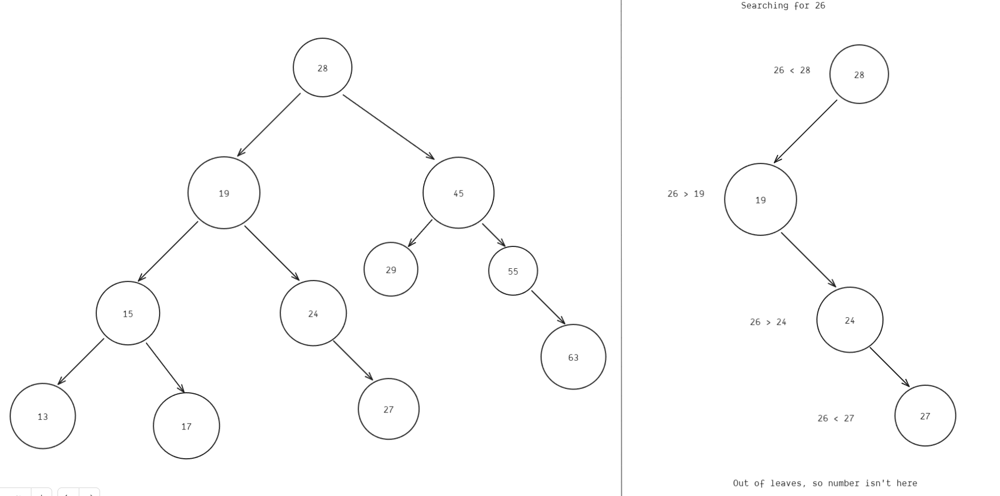

## Binary Search Trees

Binary tree's are tree's with a few rules. The actual rules are very math-y, so I've simplified
but you should look at resources if you want to implement one of these:

1. When Adding nodes, add them to the left if they are less than current, and right if more
2. Every node can have at most 2 leaves

Binary search trees are more strict, to check if a number is present you start from the root
and go left if number is smaller and right if number is bigger

Imagine the sorted list `[13,15,17,19,24,27,28,29,45,55,63]`, below is a visualization for the search tree, and the process for searching:



This can lead to searching for numbers in the tree being much faster:

```
Looking for 26
==============
Linear Search: 5 Checks
Tree: 4 checks

Looking for 58
==============
Linear Search: 10 Checks
Tree: 4 checks
```

## Results of example

Running the example.py here are some results

```
runs = 10
number of searches per run = 100
max value = 1,000,000

==========================================

number of nodes = 1,000
BST averaged 13.830000000000002 checks
List averaged 1493.6380505050506 checks

BST is 108.00x faster 
==========================================

number of nodes = 10,000

BST averaged 18.608000000000004 checks
List averaged 14955.076323232326 checks

BST is 804.04x faster
==========================================

number of nodes = 100,000

BST averaged 22.851999999999997 checks
List averaged 150969.448 checks

BST is 6,606.40x faster
==========================================

number of nodes = 1_000,000

BST averaged 25.957 checks
List averaged 1506688.2680000002 checks

BST is 58,045.54x faster
==========================================
```

## Refernces

- [Visualization](https://www.cs.usfca.edu/~galles/visualization/BST.html)
- [Lecture 5: Binary Search Trees, BST Sort](https://www.youtube.com/watch?v=9Jry5-82I68)
- https://www.youtube.com/watch?v=mtvbVLK5xDQ
- https://www.youtube.com/watch?v=pYT9F8_LFTM

