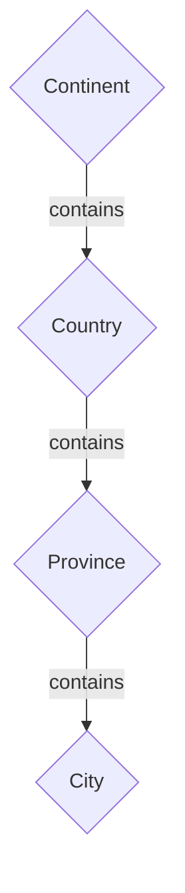
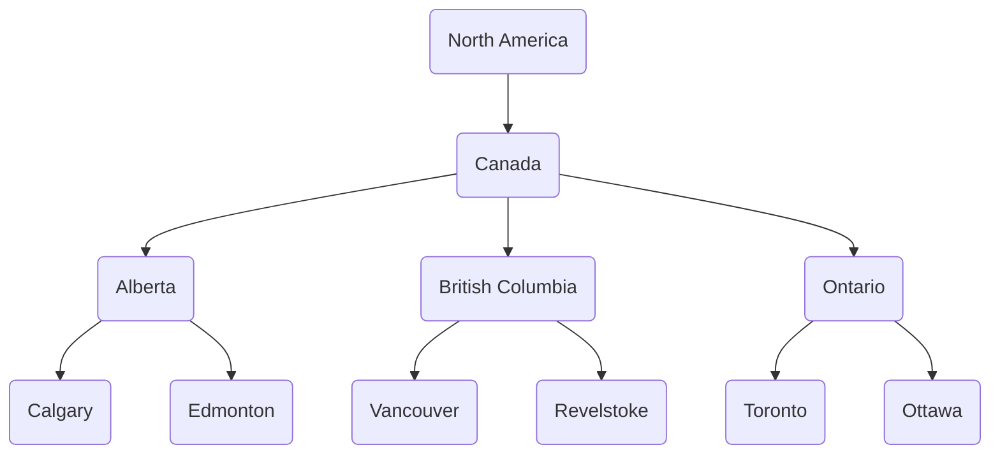
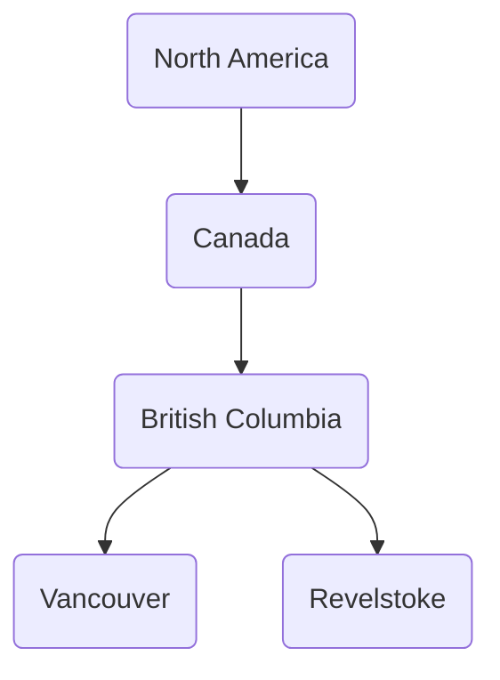
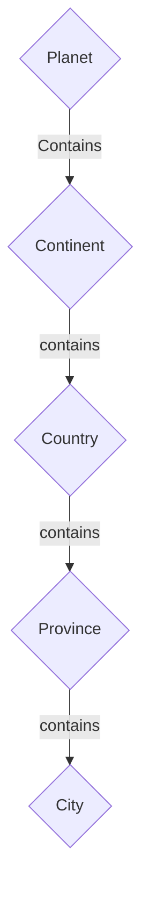

# Trees and Binary Search Trees

This is a computer science concept that comes up **a lot**. The basics are that a graph/tree is a collection of nodes that are linked together.

## Trees

Nodes can represent anything, but usually they represent an object in a hierarchy. A hierarchy is just a fancy name for a structure that shows categories that are related in some way to all of the categories beneath them. This means tree's will have a "starting point" from which the other Nodes flow from (called the root). For example when talking about a location you might have a hierarchy that looks like this:



  

Where the overall category is A location from there you have continents, which contain countries, which contain provinces, which contain cities. In code this can be done using an object, or Struct. For example to represent some cities in Canada we could have:


  
We can then represent it by having a Node Class or Struct. We're going to represent the subtree of BC:


here is the pseudocode for each:

```
// Struct Version
Struct Node{
	label: String
	parent: Null or List of Node's
	child: Null or List of Node's
}

// Class Version
Class Node:
	label: String
	parent: Null or List of Node's
	child: Null or List of Node's


// Using either

/// Create Children
vancouver = Node("Vancouver", Null, Null)
revelstoke = Node("Revelstoke", Null, Null)

/// Create Parent node with children
bc = Node("British Columbia", Null, [vancouver, revelstoke])

/// Add parent to children
vancouver.parent = bc
revelstoke.parent = bc

/// Create parent Node with children
canada = Node("Canada", Null, [bc])

/// Add parent to children
bc.parent = canada

/// Create parent Node with children
na = Node("North America", Null, [canada])

/// Add parent to children
canada.parent = na
```

This is a useful visualization because each edge (arrow/line) tells you what the node is related to. So if we later want to check what cities are in Canada, we go to the Canada node, and then search all the children, then the children's children:

```
cities = []
for province in canada.children{
	for city in province.children{
		cities.add(city)
	}
}
```

This also means unlike just a traditional list/array if our model expands we have to update very few nodes. For example let's say we become space fairing, and as part of that our location tree now needs to specify which planet we're talking about. To add that node we simply add in the Planet node, and then attach the continent node to the planet (updating 1 reference in our case).



## References

- Trees
  - [Making categories simpler | Schulich Ignite](https://schulichignite.com/blog/taxonomical-ordering/)
  - The DOM
  	- [Understanding the DOM — Document Object Model | DigitalOcean](https://www.digitalocean.com/community/tutorial-series/understanding-the-dom-document-object-model)
  	- [DOM tree (javascript.info)](https://javascript.info/dom-nodes)
  - [The power of paths | Schulich Ignite](https://schulichignite.com/blog/the-power-of-paths/)
  - [Applications of tree data structure - GeeksforGeeks](https://www.geeksforgeeks.org/applications-of-tree-data-structure/)
  - [Real World Examples of Tree Structures | Baeldung on Computer Science](https://www.baeldung.com/cs/tree-examples)
- [Graph Theory Algorithms (youtube.com)](https://www.youtube.com/watch?v=DgXR2OWQnLc&list=PLDV1Zeh2NRsDGO4--qE8yH72HFL1Km93P)
- [Beginner tree algorithms | Graph Theory (youtube.com)](https://www.youtube.com/watch?v=0qgaIMqOEVs)
- [Introduction to tree algorithms | Graph Theory - YouTube](https://www.youtube.com/watch?v=1XC3p2zBK34)
- DOM
  - [Document Object Model (DOM) - Web APIs | MDN (mozilla.org)](https://developer.mozilla.org/en-US/docs/Web/API/Document_Object_Model)
  - [The DOM | Document Object Model Explained (youtube.com)](https://www.youtube.com/watch?v=lOdVijP84Rw)
  - [JavaScript DOM Manipulation -- Full Course for Beginners (youtube.com)](https://www.youtube.com/watch?v=5fb2aPlgoys)
- Additional examples
  - [Descent098/power-of-paths: This repository is meant to accompany the power of paths post](https://github.com/Descent098/power-of-paths)
  - [The power of paths | Kieran Wood](https://kieranwood.ca/tech/blog/the-power-of-paths/)
  - [Making categories simpler | Kieran Wood](https://kieranwood.ca/tech/blog/taxonomical-ordering/)
  - [Descent098/taxonomies: A repository demonstrating taxonomies (github.com)](https://github.com/Descent098/taxonomies)